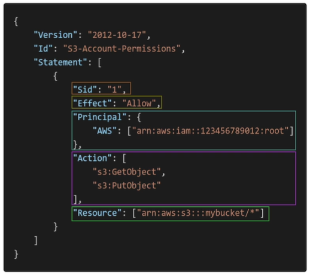

## Infraestrutura

- Regions: Local físico no mundo, no qual a AWS agrupa datacenters, sendo que cada datacenter forma um grupo lógico conhecido como zona de disponibilidade (Availability Zones - AZs).Cada região da AWS consiste em, no mínimo em 3 AZs isoladas e separadas fisica e geograficamente, e no máximo 6 AZs;
- Availability Zones: É um ou mais datacenters distintos com energia, rede e conectividade redundantes em uma region da AWS. Cada AZs está conectada entre si com uma alta banda e baixa latencia de rede
- AWS Data Centers: Cada datacenter fica separada um do outro em um raio de até 100km, e eles oferecem uma baixa latência;
- AWS Edge Locations/Points of Presence: São baiscamente servidores de cache que são localizados em grandes cidades ou grandes centros industriais ao redor do mundo. O objetivo principal das edge locations é diminuir a latência, deixando a aplicação/servidor próxima ao usuário, pois as vezes o usuário mora longe de uma region, mas pode estar perto de um edge location.

#### How to choose an AWS Region?
Vai depender de vários fatores, sendo alguns deles:
- Compliance com o governo e questões legais: Alguns governos exigem que os dados da aplicação residam no país no qual ela está sendo desenvolvida;
- Proximidade com os usuários finais para reduzir latencia;
- Disponibilidade dos serviços: Algumas regiões da AWS não possuem certos serviços habilitados;
- Preços: Varia de acordo com a região;

## IAM & AWS CLI

IAM (Identity and Access Management) é um serviço global que permite vc criar usuário e grupos para gerenciar esses usuários.
Os grupos podem conter apenas usuários, porém um usuário pode pertencer à zero ou mais grupos;

Policies: são documentos json que vão negar ou conceder permissão para que usuários ou grupos consigam acessar/executar determinados serviços da aws;
A policy consiste na seguinte estrutura, conforme a imagem:

Version: Versão da linguagem de policy;
Id: Identificador da policy (opcional);
Statements: Um ou mais declarações (obrigatório)

Cada Statement consiste em:
Sid: Um identificador do statement (opcional);
Effect: Se o statement vai permitir ou negar o acesso;
Principal: account/user/role na qual a policy vai ser aplicada;
Action: Lista de ações que essa policy permite ou nega;
Resource: Lista de recursos no qual as ações serão aplicadas;

### Protegando os usuários do IAM:
#### Password Policy:
Com o IAM, vc pode criar políticas de senhas para garantir a segurança dos usuários do IAM. E essas políticas, podem definir um número mínimo de caracteres, exigir caracteres especificos (números, maiuscula ou minusculas, não alfanúmericos e etc), rotação de senha (senha expira), prevenção de reuso de senha e etc;

#### MFA (Multi Factor Authentication):
Com IAM, vc pode proteger seus usuários com o MFA, e a AWS aceita os seguintes tipos de MFAs:

- Virtual MFA device: São softwares/apps que geram um token de tempo em tempo (Google Authenticator e Authy, por exemplo); Nessa opção, vc pode configurar diversos tokens para diferentes usuários em um msm dispositivo (celular);
- FIDO Security Key: São dispositivos usb físicos que geram um token para ser utilizado no login a partir de um toque, sem a necessidade de digitar o código manualmente; Esse dispositivo consegue gerar token para diversos usuários do IAM em um msm dispositivo (Yubico é um exemplo);
- Hardware TOTP Token: São dispositivos físicos, porém eles não precisam estar conectados ao computador (Exemplo o RSA). Eles geram tokens que permitem que o usuário faça o login, porém precisa ter um dispositivo para cada usuário;

### IAM Roles:
Alguns serviços da AWS precisam executar ações (uma lambda, por exemplo, precisa enviar dados para o bucket do S3). Assim, precisamos liberar permissões para esses serviços através do IAM Roles. Fazendo um paralelo, é como se alguns serviços da AWS fossem utilizar usuários para executar determinadas ações, porém os serviços utilizam as roles ao invés dos users.

### IAM Security tools
- IAM Relatório de credenciais (account-level): Um relatório que lista todas as seus usuários de contas e os status de suas credencias;

- IAM Consultor de acesso (user-level): Tabela que mostra as permissões de serviços aws garantidas para um usuário e quando esses serviços foram pela última vez acessados; Com esse relatório, é possível revisar as políticas (policies) para cada usuário;

## AWS Organizations
Serviço global que permite vc gerenciar multiplas contas AWS, sendo que a conta principal é conhecida como "conta de gerenciamento" (managemente account), enquanto que as outras contas, são conhecimentos "contas membros (member accounts). As member accounts podem apenas pertecer a um organização.
O AWS Organizations considera a cobrança de todas as contas com apenas um método de pagamento, além disso, é possível conseguir descontos nas cobranças dos serviços, devido a alta utilização nas members accounts (EC2, S3, e etc). Vc também pode ter compartilhamento de instancias reservadas e descontos através de multiplas contas com "Saving Plans". Além disso, com o AWS Organization, vc pode ter APIs para automatizar o processo de criação de contas AWS