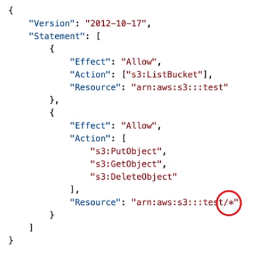

## Infraestrutura

- Regions: Local físico no mundo, no qual a AWS agrupa datacenters, sendo que cada datacenter forma um grupo lógico conhecido como zona de disponibilidade (Availability Zones - AZs).Cada região da AWS consiste em, no mínimo em 3 AZs isoladas e separadas fisica e geograficamente, e no máximo 6 AZs;
- Availability Zones: É um ou mais datacenters distintos com energia, rede e conectividade redundantes em uma region da AWS. Cada AZs está conectada entre si com uma alta banda e baixa latencia de rede
- AWS Data Centers: Cada datacenter fica separada um do outro em um raio de até 100km, e eles oferecem uma baixa latência;
- AWS Edge Locations/Points of Presence: São baiscamente servidores de cache que são localizados em grandes cidades ou grandes centros industriais ao redor do mundo. O objetivo principal das edge locations é diminuir a latência, deixando a aplicação/servidor próxima ao usuário, pois as vezes o usuário mora longe de uma region, mas pode estar perto de um edge location.

#### How to choose an AWS Region?
Vai depender de vários fatores, sendo alguns deles:
- Compliance com o governo e questões legais: Alguns governos exigem que os dados da aplicação residam no país no qual ela está sendo desenvolvida;
- Proximidade com os usuários finais para reduzir latencia;
- Disponibilidade dos serviços: Algumas regiões da AWS não possuem certos serviços habilitados;
- Preços: Varia de acordo com a região;

## IAM & AWS CLI

IAM (Identity and Access Management) é um serviço global que permite vc criar usuário e grupos para gerenciar esses usuários.
Os grupos podem conter apenas usuários, porém um usuário pode pertencer à zero ou mais grupos;

#### Policies: 
são documentos json que vão negar ou conceder permissão para que usuários ou grupos consigam acessar/executar determinados serviços da aws;
A policy consiste na seguinte estrutura, conforme a imagem:

Version: Versão da linguagem de policy;
Id: Identificador da policy (opcional);
Statements: Um ou mais declarações (obrigatório)

Cada Statement consiste em:
Sid: Um identificador do statement (opcional);
Effect: Se o statement vai permitir ou negar o acesso;
Principal: account/user/role na qual a policy vai ser aplicada;
Action: Lista de ações que essa policy permite ou nega;
Resource: Lista de recursos no qual as ações serão aplicadas;

As policies podem ser aplicadas à nível de recurso ou à nível de objeto, por exemplo, na policy abaixo temos duas permissões diferentes, sendo a primeira uma policy à nível de recurso da aws (bucket) e a outra à nível de objetos que estão dentro do bucket:

### Protegando os usuários do IAM:
#### Password Policy:
Com o IAM, vc pode criar políticas de senhas para garantir a segurança dos usuários do IAM. E essas políticas, podem definir um número mínimo de caracteres, exigir caracteres especificos (números, maiuscula ou minusculas, não alfanúmericos e etc), rotação de senha (senha expira), prevenção de reuso de senha e etc;

#### MFA (Multi Factor Authentication):
Com IAM, vc pode proteger seus usuários com o MFA, e a AWS aceita os seguintes tipos de MFAs:

- Virtual MFA device: São softwares/apps que geram um token de tempo em tempo (Google Authenticator e Authy, por exemplo); Nessa opção, vc pode configurar diversos tokens para diferentes usuários em um msm dispositivo (celular);
- FIDO Security Key: São dispositivos usb físicos que geram um token para ser utilizado no login a partir de um toque, sem a necessidade de digitar o código manualmente; Esse dispositivo consegue gerar token para diversos usuários do IAM em um msm dispositivo (Yubico é um exemplo);
- Hardware TOTP Token: São dispositivos físicos, porém eles não precisam estar conectados ao computador (Exemplo o RSA). Eles geram tokens que permitem que o usuário faça o login, porém precisa ter um dispositivo para cada usuário;

### IAM Roles:
Alguns serviços da AWS precisam executar ações (uma lambda, por exemplo, precisa enviar dados para o bucket do S3). Assim, precisamos liberar permissões para esses serviços através do IAM Roles. Fazendo um paralelo, é como se alguns serviços da AWS fossem utilizar usuários para executar determinadas ações, porém os serviços utilizam as roles ao invés dos users.

### IAM Security tools
- IAM Relatório de credenciais (account-level): Um relatório que lista todas as seus usuários de contas e os status de suas credencias;

- IAM Consultor de acesso (user-level): Tabela que mostra as permissões de serviços aws garantidas para um usuário e quando esses serviços foram pela última vez acessados; Com esse relatório, é possível revisar as políticas (policies) para cada usuário;

### IAM Conditions
É possível restringir acessos de um cliente através do IP que ele utiliza para fazer chamadas em uma API. Com o recurso "aws:SourceIp", conseguimos, por exemplo, montar a seguinte policy:

Nesse caso, estamos negando qualquer acesso aos serviços da AWS para todos os ranges de IPs que não forem "192.0.2.0/24" e "203.0.113.0/24". Um outro exemplo, é que podemos restringir clientes que estão fazendo chamadas a partir de uma região especifica da aws com o "aws:RequestedRegion":

Já nesse exemplo abaixo, podemos também restringir serviços baseados em tags de algum serviço da própria aws e/ou tags do próprio usuário com os recursos "[serviço]:ResourceTag/[Tag]" e "aws:PrincipalTag/[Tag]" respectivamente, sendo que [serviço] é o nome do serviço da aws na qual a tag está atrelada e [Tag] é o nome da tag em si. No exemplo abaixo, temos uma condição que permite iniciar ou parar instancias ec2, caso o recurso do ec2 tenha a tag com a chave e valor "Project = DataAnalytics" e caso o usuário tenha a tag com a chave e valor "Departament = Data".

Também conseguimos utilizar como condição das politicas do IAM o "aws:MultiFactorAuthPresent" que força a verificar se o usuário tem ou não o MFA habilitado, exemplo:

Podemos também retringir os acessos em certas contas que são membros de uma AWS Organization com o "aws:PrincipalOrgID". Vamos supor que temos uma politica que permite ações de put e get nos objetos do bucket S3 a partir de chamadas que são realizadas em contas que são "membros ou filhas" de uma AWS organization com id "o-yyyyyyy", nesse caso, teremos:

#### IAM Roles vs Resouce-Based Policies
Quando você assume uma role (usuário, aplicação ou serviço), você perde as suas permissões originais and toma possa das permissões garantidas pela role. Por outro lado, quando você usa uma política baseada em recurso (resource-based policy), você não perde suas permissões.

**Exemplo:** Suponha que um usuário da conta A (conta aws), precisa ler os dados de uma tabela do dynamodb que se encontra também na conta A e depois transferi-los para um bucket do S3 de backup que se encontra em uma conta B.
Caso o usuário da conta A assuma uma role da conta B para conseguir transferir os dados para o bucket de backup da conta B, ele vai perder as permissões de leitura da tabela do dynamodb (que se encontra na conta A). Neste cenário, o ideal é utilizar uma resource-based policies para que o usuário não perca as permissões de leitura do dynamodb em detrimento de ganhar o acesso ao bucket de backup do S3 na conta B.

Alguns serviços da AWS já permitem o "resource-based policy" como por exemplo: SNS, SQS, CloudWatch Logs, API Gateway e etc. Por outro lado, alguns serviços como Kinesis stream, ECS task, System Manager Run Commands e etc ainda não permitem essa opção, sendo assim, é necessário criar iam roles para acessar esses serviços;

**Exemplo:** Suponha que você tenha configurado o EventBrigde para executar algum tipo de regra em algum recurso. Você vai precisar saber se o recurso alvo (s3, sns, kineses e etc) aceita ou não resource based policy, pois isso vai decidir se o EventBridge vai precisar assumir uma role ou se ele vai apenas utilizar resouce based policy para executar a regra no recurso alvo.

#### IAM Permission Boundaries (Limite de permissões do IAM)
 Com essa funcionalidade você consegue impor limites de permissões para users ou roles do IAM.

 ** Exemplo:** Vamos supor que um usuário de uma conta AWS está com permissão de admin, porém foi configurado para ele um limite de permissão (permission boundary) dando acesso apenas ao S3 (através de uma policy). Esse usuário, só vai conseguir acessar o S3, pois suas permissões foram limitadas.

Você pode utilizar o IAM Permission boundaries junto com a SCP (Service Control Policies) do AWS Organizations.

Alguns casos de uso:

- Permitir que developers consigam liberar e gerenciar suas próprias permissões, ao mesmo tempo que garanta que eles não vão conseguir escalar suas próprias permissões (se tornarem admin);
- Restringir um usuário especifico ao invés de aplicar essa restrição para toda uma conta através do uso do SCP;
- Delegar responsabilidades para usuários comuns (sem permissão de admin) dentro do limite de suas permissões, por exemplo criar novos usuários IAM;

Abaixo temos um diagrama que mostra a lógica de liberação de acesso do IAM Policy

**Exemplo:**
O que essa policy faz? 

1 - É possível executar a criação de um tópico sqs (sqs:CreateQueue)? 
R: Não, pois temos uma negativa explicita para qqlr ação do sqs (sqs:*)
2 - É possível fazer uma deleção de tópico (sqs:DeleteQueue)?
R: Apesar do conflito do allow e do deny, não seria possível deletar um tópico um tópico. Segundo a imagem que mostra a lógica de liberação de acesso do IAM Policy, sempre que tiver um deny explicito, o acesso será bloqueado;
3 - É possível ver as instâncias do ec2 (ec2:DescribeInstances)?
R: Segunda a lógica do IAM Policy, por não ter uma permissão explicita de acesso, não é possível executar essa ação, pois implicitamente, essa ação já negada por padrão (principio do menor acesso)

## AWS Organizations
Serviço global que permite vc gerenciar multiplas contas AWS, sendo que a conta principal é conhecida como "conta de gerenciamento" (managemente account), enquanto que as outras contas, são conhecimentos "contas membros (member accounts). As member accounts podem pertecer apenas a um organização.
O AWS Organizations considera a cobrança de todas as contas com apenas um método de pagamento, além disso, é possível conseguir descontos nas cobranças dos serviços, devido a alta utilização nas members accounts (EC2, S3, e etc). Vc também pode ter compartilhamento de instancias reservadas e descontos através de multiplas contas com "Saving Plans". Além disso, com o AWS Organization, vc pode ter APIs para automatizar o processo de criação de contas AWS
Com o AWS Organizations, vc pode ter "Unidades Organizacionais" (Organizational Units - OU) para organizar melhor suas contas AWS. E essa divisão pode ser feita de várias maneiras (divisão por negócio, ambiente ou projetos), conforme a imagem abaixo:

#### Vantagens do AWS Organizations:
- Maior segurança e organização, pois multiplas contas separadas são mais seguras e mais fáceis de gerenciar do que uma única conta com múltiplas VPC;
- Facilidade no gerenciamentos de logs: Vc pode habilitar "CloudTrail" em todas as contas, envio de logs para um conta central de logging com S3 e cloudwatch;
- Habilitar iam roles compartilhadas entre contas para melhor administração das contas;
- Service Control Policies (SCP): Políticas do IAM aplicadas em OU ou Contas AWS (exceto a management account) para restringir Users e Roles do IAM. Essas políticas por default não liberam nenhum acesso, e precisam ser explicitadas. Abaixo tem um exemplo de cenário de uso para SCP:

Nesse caso, temos 4 OUs (Root, Prod, HR e Finance) e 4 accounts (Management, A, B e C). A Root OU tem uma SCP que concede acesso de admin completo, e a management account está dentro dessa OU porém, com uma SCP que bloqueia o acesso ao Athena. Nesse caso, a management account vai ter total acesso aos serviços da AWS, inclusive ao Athena, pois a SCP da OU é mais prioritária, garantindo total acesso. Para a account A, vamos ter um acesso total ao serviços da AWS (herdou da Root OU), porém não teremos acesso ao RedShift, pois a OU Prod tem uma SCP negando esse acesso e mesmo a account A permitindo com uma SCP o acesso ao RedShift, o acesso será negado, pois a negativa do SCP é mais prioritária.
Para a account B, vms ter total acesso aos serviços da AWS (herdou da Root OU), não teremos acesso ao RedShif (herdou da OU Prod), e também não teremos acesso à Lambda (herdou da OU HR). E por fim, para Account C, vamos ter total acesso aos serviços da AWS (herdou da Root OU) e bloqueio ao RedShift (herdou da OU Prod); 

Abaixo temos dois exemplos diferentes de SCPs:

Na imagem mais à esquerda, temos um cenário no qual apenas o dynamodb será bloqueado nessa conta ou OU, e os demais serviços serão liberados. Já na imagem mais à direita, apenas o ec2 e cloudwatch serão liberados, os demais serviços serão bloqueados, pois a SCPs trabalha com permissões explicitas.